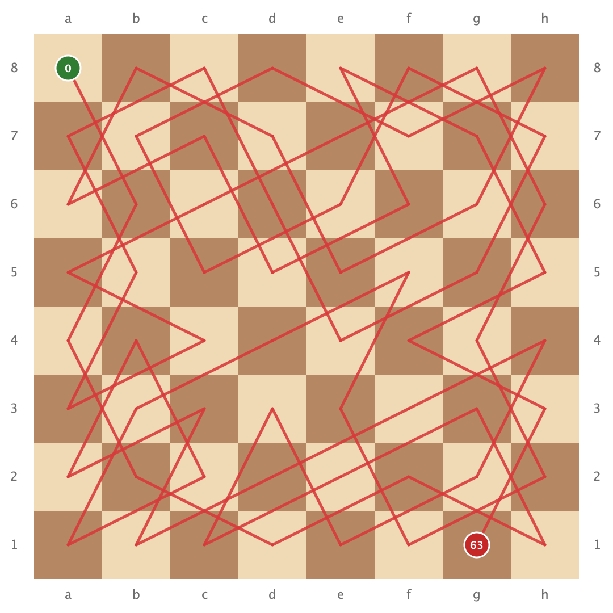

# Das Springerproblem (Knight's Tour) in Java

Ein interaktives Lehr- und Übungsprojekt für Studierende und Programmieranfänger:innen.  
Hier lernst du, wie man eines der berühmtesten Probleme der Informatik und Mathematik mit **rekursivem Backtracking** löst und das Ergebnis mit **Java Swing** grafisch auf einem Schachbrett darstellt.

<p align="center">
  
</p>

---

## Die Intuition: Worum geht es eigentlich?

Stell dir vor, du stehst mit einer Springer-Figur auf einem leeren Schachbrett.

> **Die Herausforderung:**  
> Schaffst du es, den Springer so über das Brett springen zu lassen, dass er **jedes einzelne der 64 Felder genau einmal** besucht und am Ende kein Feld unbesucht bleibt?

### Warum ist das für Menschen (und Computer) so knifflig?
Ein Springer darf sich nicht beliebig bewegen, sondern ausschließlich im bekannten **L-Muster**:
* 2 Felder geradeaus, 1 Feld zur Seite – oder
* 1 Feld geradeaus, 2 Felder zur Seite.

Wenn man einfach "drauflosspringt", stellt man schnell fest: Nach 20 oder 30 Zügen landet der Springer plötzlich in einer **Sackgasse**! Alle erreichbaren Felder wurden bereits besucht, und es gibt keinen Ausweg mehr.

```text
       col-2  col-1   col   col+1  col+2
row-2    .     [7]     .     [0]     .
row-1   [6]     .      .      .     [1]
 row     .      .    KNIGHT   .      .
row+1   [5]     .      .      .     [2]
row+2    .     [4]     .     [3]     .
```
*Von der Position des Springers gibt es im besten Fall maximal 8 mögliche Zielfelder.*

Um dieses Problem verlässlich zu lösen, brauchen wir eine Strategie: **Backtracking**.

---

## Wie denkt der Algorithmus? (Backtracking anschaulich erklärt)

Backtracking funktioniert wie die Erkundung eines **Irrgartens mit Brotkrumen**:

1. **Vorwärts gehen:** Du stehst auf einem Feld und probierst die erste erlaubte Richtung aus.
2. **Spur hinterlassen:** Du markierst das neue Feld mit der aktuellen Zugnummer (Brotkrume), damit du nicht im Kreis läufst.
3. **Die Zukunft fragen:** Von dort aus versuchst du, den Rest des Schachbretts zu lösen (rekursiver Methodenaufruf).
4. **Erfolg?** Wenn alle Felder besucht wurden: Perfekt, wir sind fertig!
5. **Sackgasse?** Wenn von der aktuellen Position aus kein gültiger Zug mehr möglich ist und noch freie Felder übrig sind:
   * **Rückgängig machen:** Nimm die Brotkrume wieder weg (Feld wieder auf `-1` setzen).
   * **Umkehren:** Gehe einen Schritt zurück zu dem Feld, von dem du kamst.
   * **Alternative probieren:** Probiere dort die nächste der 8 Richtungen aus.

Dieses systematische *"Probieren – bei Sackgasse umkehren – Alternative wählen"* nennt man **Backtracking**.

---

## Schritt-für-Schritt-Anleitung für deine Implementierung

Wenn du diese Aufgabe selbst programmierst, teile das Problem in kleine, verständliche Teilaufgaben auf:

### 1. Das Schachbrett im Speicher abbilden
Wir modellieren das Brett als zweidimensionales Integer-Array:
```java
int[][] board = new int[N][N];
```
* Zu Beginn ist jedes Feld unbesucht: Fülle alle Einträge mit `-1`.
* Sobald der Springer ein Feld betritt, speicherst du dort die Zugnummer (Startfeld = `0`, nächstes Feld = `1`, ..., letztes Feld = `N*N - 1`).

### 2. Die 8 Springer-Sprünge als relative Koordinaten
Statt 8 verschachtelte `if`-Abfragen zu schreiben, nutzt man in der Praxis zwei Arrays für die relativen Schrittweiten `(x, y)`:
```java
int[] xMoves = { 1,  2, 2, 1, -1, -2, -2, -1};
int[] yMoves = {-2, -1, 1, 2,  2,  1, -1, -2};
```
Der i-te mögliche Zug von `(row, col)` aus lautet dann einfach:
```java
int nextRow = row + xMoves[i];
int nextCol = col + yMoves[i];
```

### 3. Der "Türsteher": `isValid(board, row, col)`
Bevor der Springer springen darf, muss geprüft werden:
1. Liegt `nextRow` und `nextCol` noch **innerhalb des Brettes**? (`0 <= row < N` und `0 <= col < N`)
2. Ist das Feld noch **unbesucht**? (`board[row][col] == -1`)

### 4. Das Herzstück: Die rekursive Methode
Die Hilfsmethode folgt folgendem klaren Schema:

```text
Funktion loeseSpringer(board, row, col, moveCount):
    Wenn moveCount == N * N:
        GIB TRUE ZURÜCK (Alle Felder erfolgreich besucht!)

    Für jeden der 8 möglichen Züge i von 0 bis 7:
        Berechne nextRow, nextCol
        Wenn isValid(board, nextRow, nextCol):
            board[nextRow][nextCol] = moveCount   // 1. Schritt machen
            speichere Pfad für GUI

            Wenn loeseSpringer(board, nextRow, nextCol, moveCount + 1) == TRUE:
                GIB TRUE ZURÜCK                   // 2. Lösung gefunden!

            board[nextRow][nextCol] = -1          // 3. Backtracking: Schritt zurücknehmen!

    GIB FALSE ZURÜCK (Keine der 8 Richtungen führte zum Ziel)
```

---

## Projektstruktur

```text
Springerproblem/
├── src/
│   └── schachbrett/
│       ├── Springer.java      # Berechnungslogik & Backtracking (Musterlösung)
│       └── Schachbrett.java   # Swing-GUI: Zeichnet Brett und roten Pfad
├── knights_tour.png           # Fertige Visualisierung der Lösung (PNG)
├── Springerproblem.iml        # IntelliJ IDEA Projektdatei
└── README.md                  # Projekt- und Aufgabenbeschreibung
```

---

## Ausführen des Projekts

### In der IDE (IntelliJ IDEA, Eclipse, VS Code)
1. Projekt in der IDE öffnen.
2. Ordner `src` als **Source Folder** markieren.
3. Rechtsklick auf:
   * **`Schachbrett.java`** -> `Run` (Startet die GUI und zeichnet den Weg).
   * **`Springer.java`** -> `Run` (Gibt die Lösungsmatrix im Terminal aus).

### Über das Terminal

```bash
# Kompilieren in den Ordner bin/
javac -d bin src/schachbrett/*.java

# 1. Konsolenausgabe (Matrix)
java -cp bin schachbrett.Springer

# 2. Graphische Anzeige (Swing-Fenster)
java -cp bin schachbrett.Schachbrett
```

---

## Wichtige Tipps und Hintergrundwissen

### Performance-Falle: Vorsicht mit `System.out.println`
* Bei naivem Backtracking auf 8x8 Feldern probiert der Computer **über 3,2 Millionen Schritte** aus.
* Wer in der inneren Rekursionsschleife bei jedem Fehltritt eine Ausgabe (`System.out.println`) macht, bremst das Programm dramatisch aus: Das Drucken auf der Konsole dauert mehrere Minuten und kann deine IDE einfrieren lassen!
* **Ohne Konsolenausgabe** in der Schleife löst derselbe Java-Code das Problem in **nur ~40 Millisekunden**! In `Springer.java` gibt es dafür das Flag `DEBUG = false`.

### Zum Ausprobieren: Starte klein (5x5 oder 6x6)
Um deinen Code Schritt für Schritt mit dem Debugger nachzuvollziehen:
* Setze `N = 5` in `Schachbrett.java`: Das 5x5 Brett wird in ca. 40 Schritten fast augenblicklich gelöst!
* *Fun Fact:* Auf einem 4x4 Schachbrett gibt es mathematisch bewiesen **keine** vollständige Lösung für das Springerproblem.

### Bonus-Challenge: Die Warnsdorff-Heuristik
Warum läuft sich der Springer auf 8x8 überhaupt 3 Millionen Mal fest?  
Weil er zu Beginn oft in die Mitte springt und dabei Felder belegt, die er später dringend bräuchte, um aus den Ecken wieder herauszukommen (eine Ecke hat nur 2 Fluchtwege!).

**Die Warnsdorff-Regel (1823):**
> *Wähle als nächsten Zug immer das freie Feld, das seinerseits die **geringste Anzahl an noch freien Folgezügen** besitzt ("Besuche die einsamsten Felder zuerst").*

Wenn du diese Sortierung einbaust, findet dein Algorithmus die Lösung auf 8x8 fast **ohne einen einzigen Fehlschritt** in weniger als 5 Millisekunden!

---

## Die Referenzlösung

In [`src/schachbrett/Springer.java`](src/schachbrett/Springer.java) findest du eine saubere, ausführlich kommentierte Musterlösung. Du kannst sie nutzen, um:
* Dein eigenes Ergebnis zu vergleichen,
* Nachzuvollziehen, wie die Züge im `path`-Array für das GUI-Schachbrett aufbereitet werden,
* Zu sehen, wie Backtracking in sauberem Java-Code umgesetzt wird.

---

## Nützliche Links & Ressourcen

* [Jappuccini Java Docs](https://jappuccini.github.io/java-docs/production/) – Umfassende Dokumentation, Kursunterlagen und Referenzen für Java-Grundlagen
* [Vorlesungsunterlagen (Zoe Pfob)](https://zoe-pfob.de/lectures/) – Vorlesungsfolien und begleitende Lehrmaterialien
* [Baeldung Java Tutorials](https://www.baeldung.com/) – Verständliche Guides zu Algorithmen, Datenstrukturen und Java Best Practices
